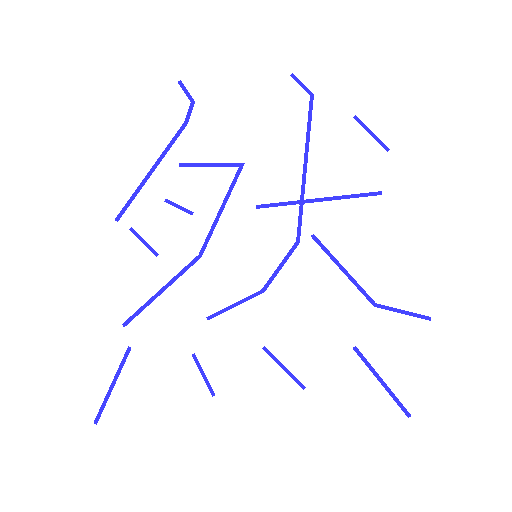
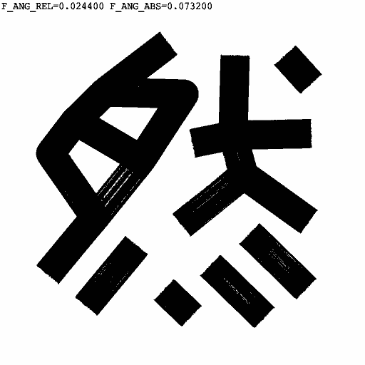

# Duct Tape 膠帶體

Algorithmically-generated, duct-tape-resembling Chinese typeface by applying a force-directed physics simulation and a subtle brushtroke effect to the [MakeMeAHanzi](https://github.com/skishore/makemeahanzi) character skeleton dataset. 

**The TrueType Fonts can be [downloaded](https://github.com/LingDong-/duct-tape-font/releases) for free personal use and free commercial use**. See COPYING.txt for details. 

| Force-directed simulation | Angular constraint tightness |
|---|---|
|  |  |


## Instructions

You can download the fonts with preset styles from [Releases](https://github.com/LingDong-/duct-tape-font/releases). The fonts can be used with any program that supports TTF format. They're best set with top-to-bottom (TTL) layout.

Two styles are currently provided, one with strict octilinear angular constraint (Regular) and one without (Irregular):

- [DuctTapeRegular.ttf](https://github.com/LingDong-/duct-tape-font/releases) 膠帶體·正
- [DuctTapeIrregular.ttf](https://github.com/LingDong-/duct-tape-font/releases) 擬草體·拗

### Generate from Scratch

- Install the [Dither programming language](https://github.com/LingDong-/dither-lang), and node.js
- Preset script styles configs are available, e.g. `cfg.regular.json`. To create your own, copy one of the `cfg.*.json`, rename the `*` part and change the parameters.
- Run `make [style]` (e.g. `make regular`) to build the font. Use `make all` to build all three presets, or substitute `[style]` with the name of your own config.
- To preview a visualization of the generation process without writing to files, use (e.g.): 

```
dither -xvt c tape.dh show cfg.regular.json
```

### Parameters / How it works

Many forces are involved in the physics simulation.

- Constraint on the angle of each edge (octilinear): relative angle between neighboring edges (`f_ang_rel`), absolute angle of the edge (`f_ang_abs`)
- Constraint on the length of each edge (integer multiples of `len_seg`): `f_spring`, `mul_compress`.
- Repulsion between non-neighboring edges and nodes: `f_repel_seg`, `f_repel_pt`. Collision prevention: `mul_hit_seg`, `mul_hit_pt`.
- Repulsion from canvas border: `f_border`.

## Gallery

All samples below (as well as the banner image) are typeset with fonts created with the same algorithm, some under different parameters.


-------

The project is written from scratch by hand in [Dither](https://github.com/LingDong-/dither-lang), a new programming language for creative coding, developed by the author at MIT Media Lab.